# Spring 2025 ECSE Design Methodology Project

Below I will showcase by far the most challenging project I have ever worked on. The course required my 4 randomly assigned teamates and I to complete weekly progress/design goals with only little explanation on how to do so and rigorous documentation for each phase of our design. For The design itself, it could only consist of preapproved parts and powered by a 24V DC supply.

I refer to myself as a "Lead Designer" on this project and I mean it. Between me and my goat Hudson Bowen, we took the lead on designing, programming, and testing every single one of individual features.

Due to the course repeating projects every 3 years, I can not go into the exciting technical details of our design. However, I can demostrate what our glorious creation was capable of. 

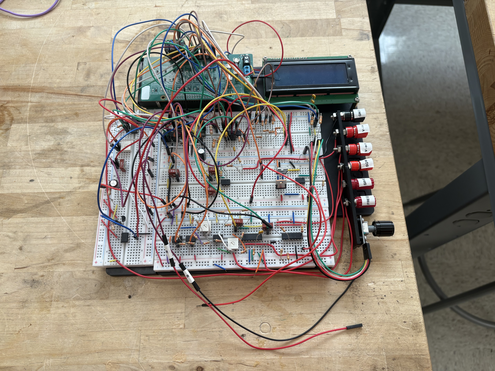

### To recieve an A in the course, our final design needed to include
----
 - Controllable LCD UI
 - Ohmmeter
 - Internal & External Voltmeter
 - DC Reference 
 - Frequency Measurement
 - Square Wave Generator
 - Sine Wave Generator

## Controllable LCD UI
For this project, our UI was displayed on an LCD screen and controlled by a KY-040 Rotary Encoder. 

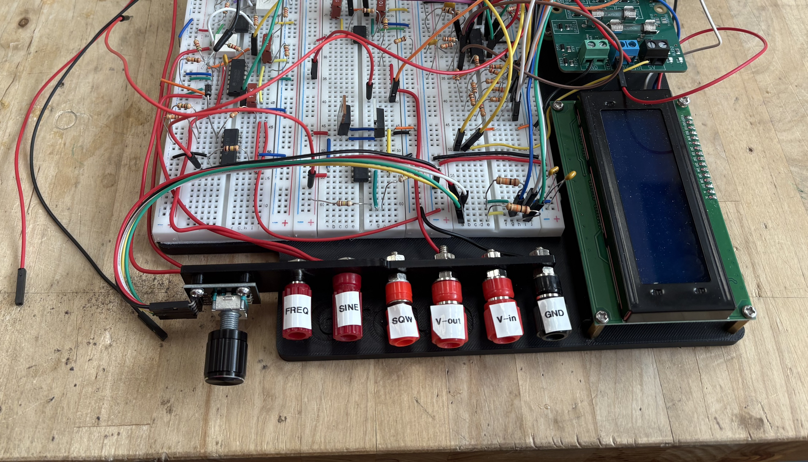

Each function of the workbench utilized its specifically labeled banana jack or female jumper wire connection. 

## Ohmmeter
The Ohmeter was required to read resistances between 500 and 10k Ohms. An accuracy reading also needed to tested and displayed on the UI. 

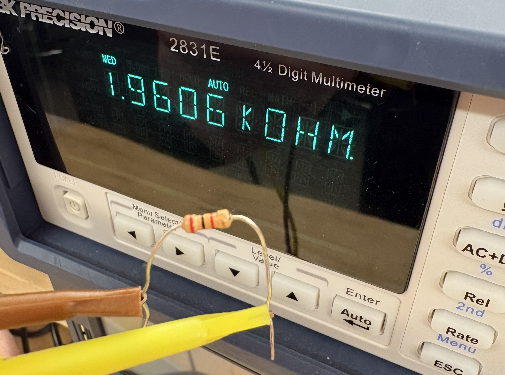
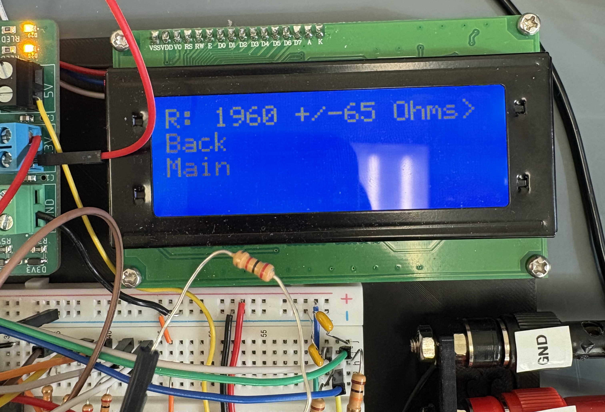

## Internal & External Voltmeter
Our Voltmeter had to read both external voltages (from a DC supply) and internal voltages (the DC Reference) within a range of +/-5V and with an accuracy with +/-0.3125V. 

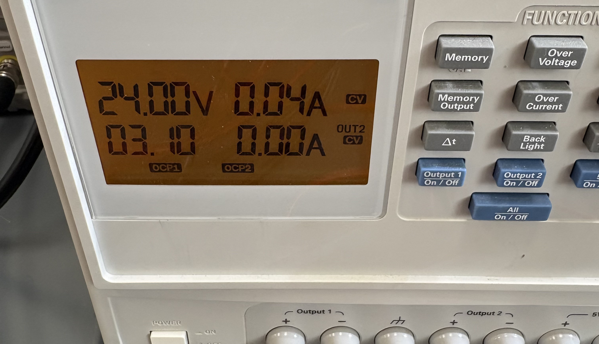
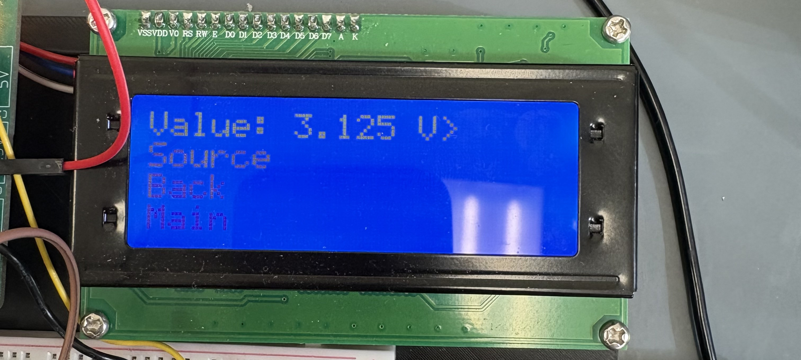

## DC Reference 
The DC Reference was required to output a stable +/-5V reference. As mentioned above, this voltage needed to be selected (the Voltage: line), and measured internally (the Meas: line) by the Voltmeter.

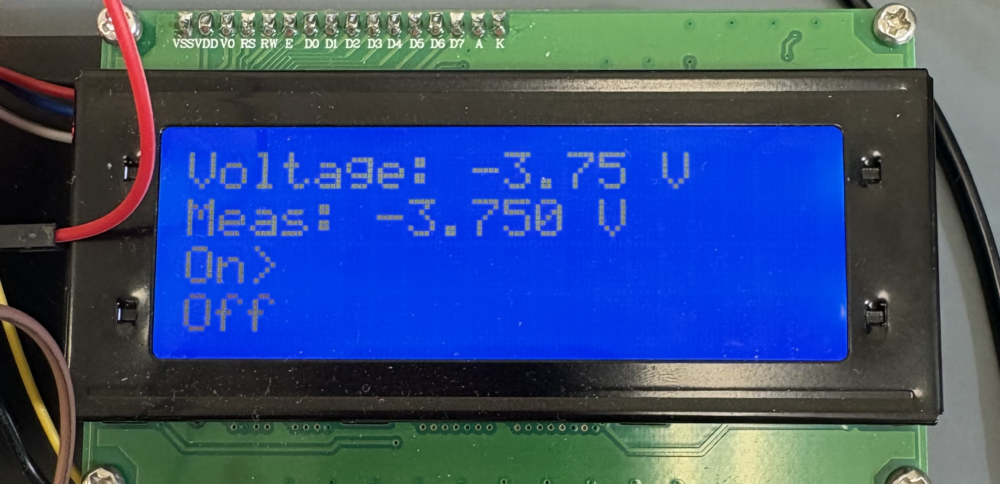

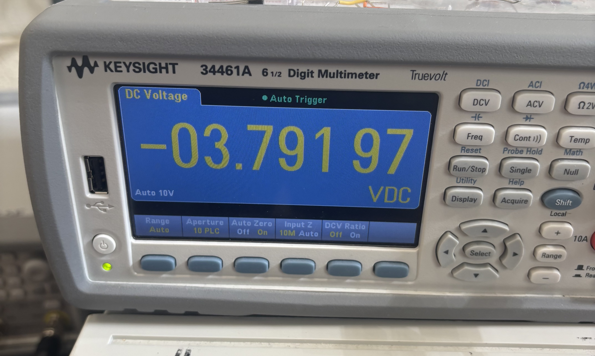

## Frequency Measurement
For the Frequency Measurement, it was required to measure a positive voltage sine wave between the 1 kHz and 10 kHz. Similarly to the Ohmmeter, an accuracy range needed to be verified and displayed on the UI.

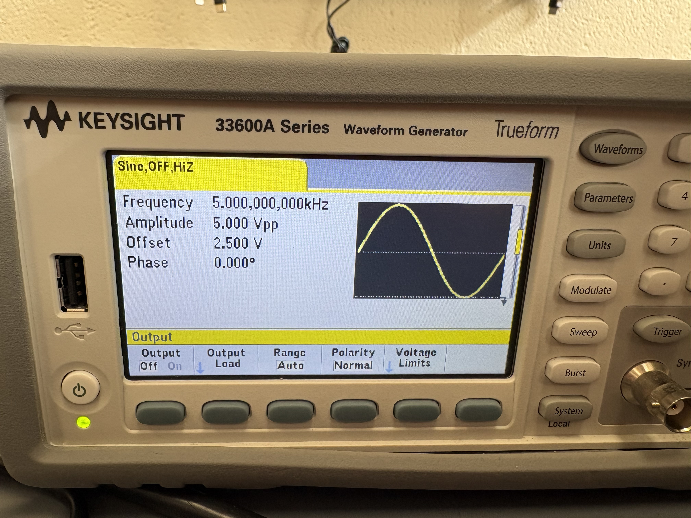
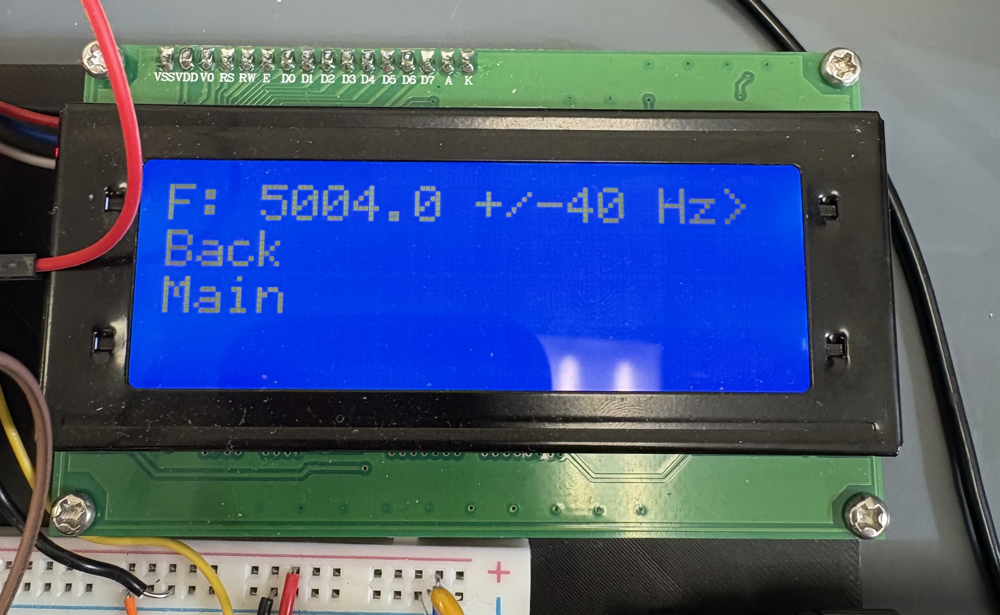

## Square Wave Generator
For the Square Wave Generator, the objective was to create a x-axis centered square wave with a 50% duty cycle with variable amplitude in steps of 0.3125 V and maximum amplitude of ± 10 V. The frequency of this wave needed to be adjustable, with a range between 100 Hz and 10 kHz, in steps of 10 Hz.

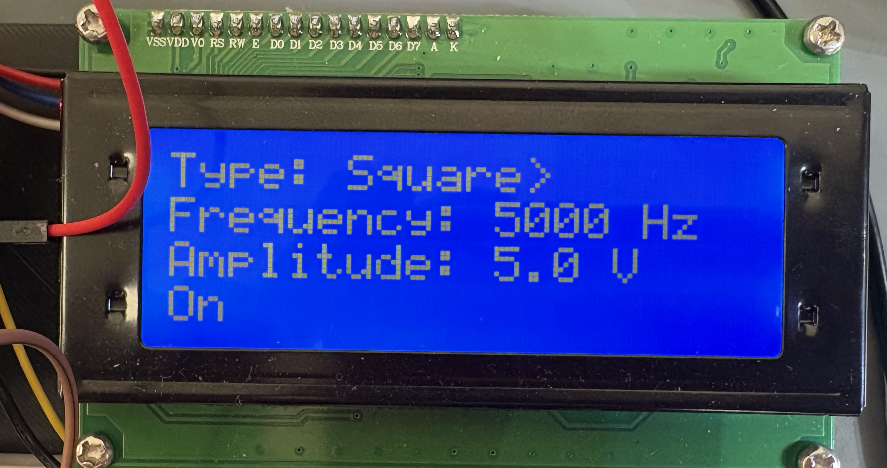
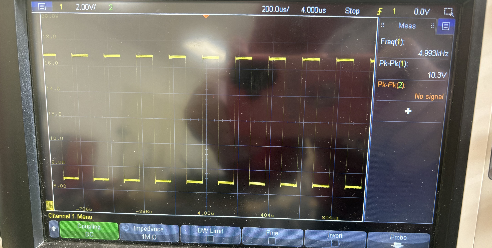

## Sine Wave Generator
The Sine Wave Generator had to be able to produce a sine wave with variable amplitude between 0 V and 10 V in steps of 0.625V, and have variable frequency between 1kHz and 10 kHz in steps of 500 Hz.

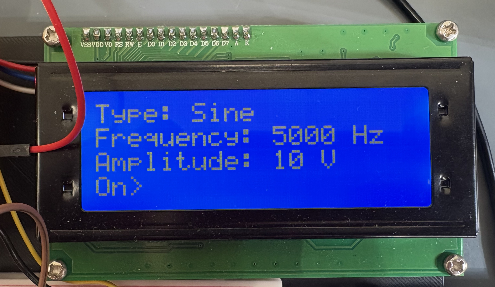
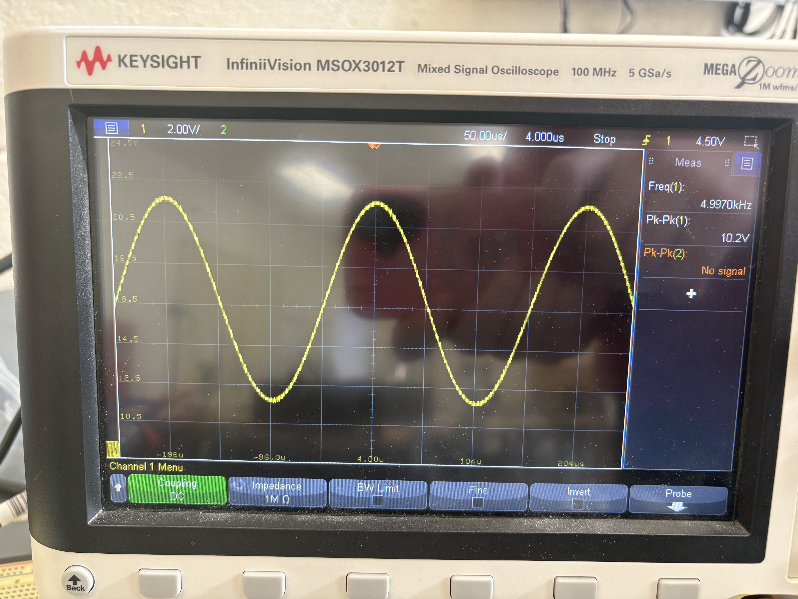
